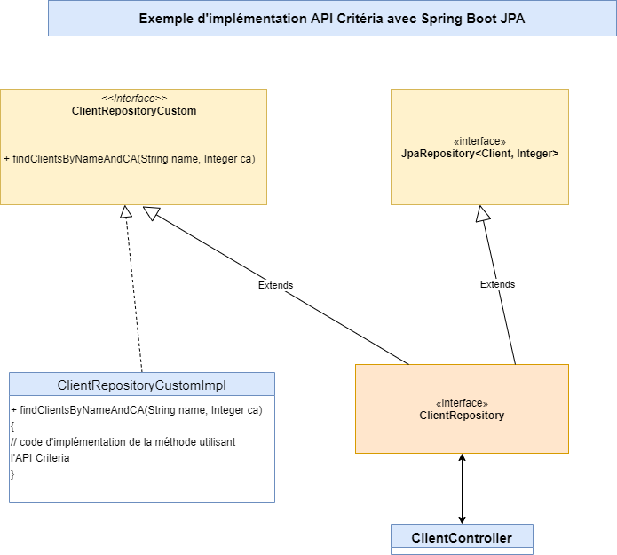
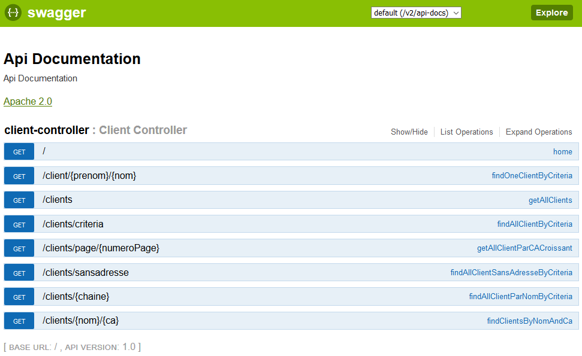

# API JPA Criteria avec Spring Boot

## Utilité

Dans cette application de démonstration, nous allons utiliser l'API **Criteria** qui permet de réaliser des requêtes sans utiliser de SQL mais plutôt par **programmation**. Cela nous permet de créer des requêtes spécifiques en fonction des besoins tout en utilisant par la même occasion les interfaces JPA et CRUD repositories habituels. _La syntaxe de l'API Criteria permet de rester dans le langage objet_.

Depuis la version 5.2 d'Hibernate, l'API Hibernate Criteria est devenue obsolète et désormais, nous devons utiliser **JPA Criteria API**

Avant de commencer, pensez à ajouter les dépendances Hibernate dans Maven ou Gradle.

## Exemple : Requête simple (quoique !)

```java
Session session = HibernateUtil.getHibernateSession();
CriteriaBuilder criteriaBuilder = session.getCriteriaBuilder();

CriteriaQuery<Client> criteriaQuery = criteriaBuilder.createQuery(Client.class);
Root<Client> root = criteriaQuery.from(Client.class);
criteriaQuery.select(root);
 
Query<Client> query = session.createQuery(criteriaQuery);
List<Client> resultats = query.getResultList();
```
  
Il est évident que le fait d'utiliser **JpaRepository** ou **CrudRepository** est plus pratique et bien plus simple pour des requêtes basiques.

Nous verrons par la suite qu'il y a plus simple en terme de mise en place.

Voici le détail des étapes ci-dessus :

- Création d'une instance de Session hibernate avec SessionFactory
- Création d'une instance de l'objet *CriteriaBuilder* en appelant la méthode *getCriteriaBuilder()*
- Création d'une instance de *CriteriaQuery* en appelant la méthode *createQuery()* de l'objet *CriteriaBuilder*
- Création d'une instance de *Query* en appelant la méthode *createQuery()*
- Appel de la méthode *getResultList()* de l'objet *Query* qui nous retourne le résultats.

## Requêtes avec la méthode **where()**

- Obtenir la liste des clients dont le CA est supérieur à 15000	:

```java
criteriaQuery.select(root).where(criteriaBuilder.gt(root.get("ca"), 15000));
```

- Obtenir la liste des clients dont le CA est inférieur à 10000 :

```java
criteriaQuery.select(root).where(criteriaBuilder.lt(root.get("ca"), 10000));
```

- Liste des clients dont le nom contient la chaîne : "MA" :

```java
criteriaQuery.select(root).where(criteriaBuilder.like(root.get("nom"), "%MA%"));
```

- Liste des clients dont le CA est compris entre 15000 et 55000 :

```java
criteriaQuery.select(root).where(criteriaBuilder.between(root.get("ca"), 15000, 55000));
```

- Liste des clients dont l'adresse est NULL :

```java
criteriaQuery.select(root).where(criteriaBuilder.isNull(root.get("adresse")));
```

- Liste des clients dont l'adresse est non NULL :

```java
criteriaQuery.select(root).where(criteriaBuilder.isNotNull(root.get("adresse")));
```

Il y a aussi les méthodes **isEmpty()** et **isNotEmpty()**.

## Utilisez un objet **Predicate** pour des requêtes qui combinent plusieurs conditions

```java
Predicate[] predicats = new Predicate[3];
predicats[0] = criteriaBuilder.isNotNull(root.get("adresse"));
predicats[1] = criteriaBuilder.like(root.get("nom"), "M%");
predicats[2] = criteriaBuilder.like(root.get("prenom"), "D%");
criteriaQuery.select(root).where(predicats);
```

Exemple avec 2 opérations logiques :

```java
Predicate caPlusGrandQue = criteriaBuilder.gt(root.get("CA"), 10000);
Predicate nomAvecDU = criteriaBuilder.like(root.get("nom"), "DU%");
```

- Avec l'opérateur logique **OR** :

```java
criteriaQuery.select(root).where(criteriaBuilder.or(caPlusGrandQue, nomAvecDU));
```

- Avec l'opérateur logique **AND** :

```java
criteriaQuery.select(root).where(criteriaBuilder.and(caPlusGrandQue, nomAvecDU));
```

## fonctions de tri

Ci-dessous :

Tri par ordre croissant sur le nom et par ordre décroissant sur le chiffre d'affaires.

```java
criteriaQuery.orderBy(
  criteriaBuilder.asc(root.get("nom")), 
  criteriaBuilder.desc(root.get("ca")));
```

## projections, aggrégation et regroupement

Tout comme avec le langage SQL, on utilise des méthodes qui portent le même nom :

- **avg()**
- **count()**
- **sum()**
- **max()**
- **min()**
- **count()**

Ci-dessous : récupération du nombre des adresses.

```java
CriteriaQuery<Long> criteriaQuery = criteriaBuilder.createQuery(Long.class);
Root<Adresse> root = criteriaQuery.from(Adresse.class);
criteriaQuery.select(criteriaBuilder.count(root));
Query<Long> query = session.createQuery(criteriaQuery);
List<Long> nombreAdresses = query.getResultList();
```

Ci-dessous : récupération du CA moyen.

```java
CriteriaQuery<Double> CriteriaQuery = cb.createQuery(Double.class);
Root<Client> root = CriteriaQuery.from(Client.class);
CriteriaQuery.select(criteriaBuilder.avg(root.get("CA")));
Query<Double> query = session.createQuery(CriteriaQuery);
List caMoyen = query.getResultList();
```

## Autres classes et méthodes de l'API Criteria

- **CriteriaUpdate<>**
- **CriteriaDelete<>**

Vous pouvez aussi explorer le package **javax.persistence.criteria** proche du package hibernate.

[https://docs.oracle.com/javaee/7/api/javax/persistence/criteria/package-summary.html](https://docs.oracle.com/javaee/7/api/javax/persistence/criteria/package-summary.html)

## Tutoriel Hibernate Criteria et Jpa Criteria, liens utiles

[https://www.tutorialspoint.com/hibernate/hibernate_criteria_queries.htm](https://www.tutorialspoint.com/hibernate/hibernate_criteria_queries.htm)

[https://www.objectdb.com/java/jpa/query/criteria](https://www.objectdb.com/java/jpa/query/criteria)

## 3 manières d'utiliser JPA Criteria avec SpringBoot

- Créer une classe avec l'annotation **@Repository**
- Etendre la classe Repository avec des méthodes personnalisées
- Utiliser les spécifications JPA de Spring Data Jpa.

### Créer son propre Repository (c'est fastidieux, mais faisable)

```java 
@Repository
class ClientRepository {
 
EntityManager entityManager;
 
List<Client> findClientByNomAndCA(String name, Integer ca)
	{
	CriteriaBuilder criteriaBuilder = entityManager.getCriteriaBuilder();
    CriteriaQuery<Client> criteriaQuery = criteriaBuilder.createQuery(Client.class);
	Root<Client> client = criteriaQuery.from(Client.class);
	Predicate nomPredicate = criteriaBuilder.equal(client.get("nom"), nom ); // création du premier prédicat
    Predicate caPredicate = criteriaBuilder.gt(client.get("ca"), 15000));	 // création du second prédicat
    criteriaQuery.where(nomPredicate, caPredicate);							 // on combine les 2 prédicats
	TypedQuery<Client> query = entityManager.createQuery(criteriaQuery);	 // on exécute la requête
    return query.getResultList();											 // on retourne la liste
    }
}
```

### Etendre la classe **Repository** avec une interface personnalisée (recommandée)

Etapes :

1 - Il est possible d'implémenter des méthodes spécifique avec l'API Criteria dans une autre interface _ClientRepositoryCustom_ comme ci-dessous :

```java
interface ClientRepositoryCustom {
    Set<Client> findClientsByNomAndCA(String name, Integer ca);
}
```

2 - Il faut penser à créer une classe  **ClientRepositoryCustomImpl** qui implémente la ou les méthodes de l'inetrface **ClientRepositoryCustom**.

```java
interface ClientRepositoryCustomImpl implements ClientRepositoryCustom {}
```

3 - Création d'une Interface qui hérite des 2 interfaces 
- **JpaRepository**
- **ClientRepositoryCustom** (l'interface personnalisée avec Criteria)

```java
interface ClientRepository extends JpaRepository<Client, Integer>, ClientRepositoryCustom {}
```

>Remarque : Une interface peut hériter de plusieurs interfaces.



## Utiliser les spécifications JPA de Spring

Package :

```java
org.springframework.data.jpa.domain.Specification
```

Exemple :

```java
interface Specification<T> {
    Predicate toPredicate(Root<T> root, CriteriaQuery criteriaQuery, CriteriaBuilder criteriaBuilder);
}

...

public static Specification<Client> hasNom(String parametreNom) {
    return (client, criteriaQuery, criteriaBuilder) -> criteriaBuilder.equal(client.get("nom"), parametreNom);
}

public static Specification<Client> prenomContains(String chaine) {
    return (client, criteriaQuery, criteriaBuilder) -> criteriaBuilder.like(client.get("prenom"), "%" + chaine + "%");
}
```

Pour utiliser cette écriture, nous devons avoir un Repository qui hérite de **org.springframework.data.jpa.repository.JpaSpecificationExecutor<T>** puisque chaque méthode retourne un objet de type **Specification<T>**.

Exemple :

```java	
interface ClientRepository extends JpaRepository<Client, Integer>, JpaSpecificationExecutor<Client>
{

}
```

>Cette interface permet de déclarer des méthodes personnalisées liées à notre package *Specification*.

Pa exemple, nous pouvons utiliser notre méthode spécifique pour récupérer tous les clients dont le prénom contient une chaîne passée en paramètre :

```java
public static Specification<Client> prenomContains(String chaine)
```

>Limite : Une seule spécification par méthode !

Solution : enchaîner plusieurs méthodes reliées par des conditions logiques.

Exemple :

```java	
clientRepository.findAll(where(hasNom(client.getNom())).and(prenomContains(client.getprenom())));
```

Ci-dessus, **where()** est une méthode *static* de la classe **Specification**.

Avec cette classe **Specification**, on peut se passer d'utiliser l'API Criteria standart puisque c'est fourni par Spring.
Cependant, il est préférable d'utiliser l'API Criteria pour élaborer des requêtes spécifiques que ne permet pas la classe fournit par Spring !

## Interface PagingAndSortingRepository

Cette interface est bien pratique pour mettre en place une pagination lorsque nous avons beaucoup d'enregistrements et aussi pour effectuer des tris sur de multiples critères.

Voici le lien vers la documentation de Spring Data : [https://docs.spring.io/spring-data/data-commons/docs/current/api/org/springframework/data/repository/PagingAndSortingRepository.html](https://docs.spring.io/spring-data/data-commons/docs/current/api/org/springframework/data/repository/PagingAndSortingRepository.html) 

Vous constatez que cette interface hérite de **CrudRepository<>**.

2 méthodes :

- **Iterable<T> findAll(Sort sort)**
- **Page<T> findAll(Pageable pageable)**

Exemples de code

- Sans passer par *JpaRepository* :

```java
public interface ClientRepository extends PagingAndSortingRepository<Client, Integer> {
 
    List<Client> findAllByCA(Integer ca, Pageable pageable);
}
```
-En passant comme d'habitude par JpaRepository :

```java
@Repository
public interface ClientRepository extends JpaRepository<Client, Integer> {
    public List<Client> findAllByCA(Integer ca, Pageable pageable);
}
```

Etapes :

1. Créer et récupérer un Objet **PageRequest** qui est une implémentation de l'interface **Pageable**.

2. Insérer notre objet **PageRequest** comme argument de notre méthode.

3. Créer l'objet en passant le nombre d'éléments et le numéro de page.

```java
Pageable premierePageAvec10Elements = PageRequest.of(0, 10);
```

Pour effectuer un tri, il suffit de créer un objet **Pageable** et d'y intégrer la classe **Sort** et de faire appel à ces méthodes comme **by()**.

```java
Pageable sortedByNom = 
  PageRequest.of(0, 10, Sort.by("nom"));
 
Pageable sortedByCADesc = 
  PageRequest.of(0,100, Sort.by("ca").descending());
 
Pageable sortedByCADescNomAsc = 
  PageRequest.of(0, 10, Sort.by("ca").descending().and(Sort.by("nom")));
```

## Exemple à tester avec Swagger2



Lien GitHub
[https://github.com/pbougetsimplon/springdemos/tree/master/ProjetAPICriteria](https://github.com/pbougetsimplon/springdemos/tree/master/ProjetAPICriteria)